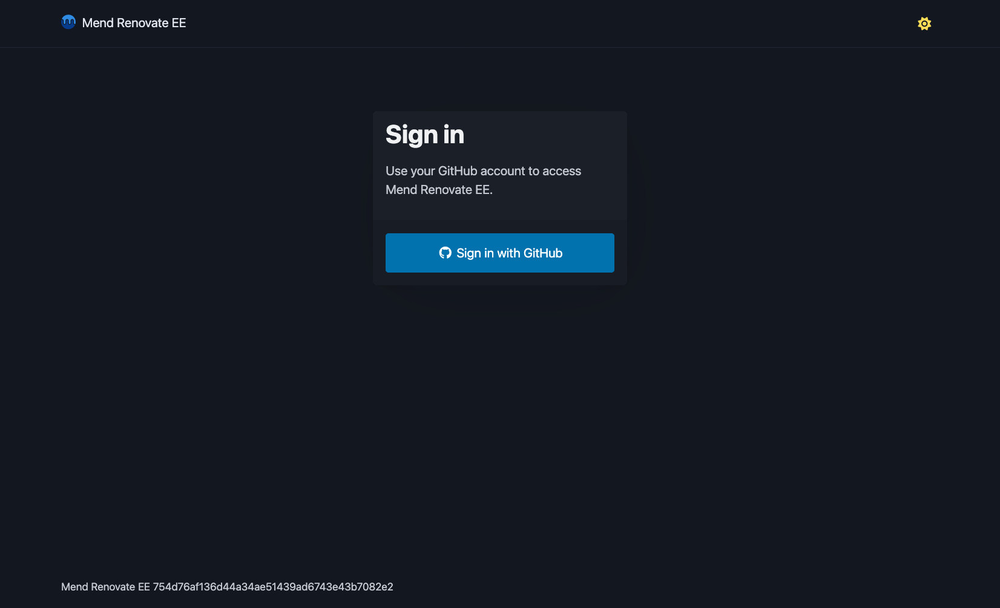

# Mend Renovate Self-Hosted Web UI

Enterprise users of Mend Renovate Self-Hosted have access to a web UI for their deployment.

> [!NOTE]
> The web UI is in active development.
>
> As part of Self-Hosted 13.6.0 (AKA Enterprise 7.6.0), the web UI is part of an **Open Beta**.
>
> Future development is planned, which will expand the functionality in the web UI.

The web UI relies upon the [Role Based Access Control functionality](rbac.md) to ensure that users can only access repositories, organizations and job logs that they are allowed to according to their access on the platform you're using.


## Supported Platforms

There are two models for authentication and authorization with the web UI:

- "Native" platform auth: uses the platform's authentication to perform a "sign in with GitHub" (or similar) flow
  - The user will see repositories, organizations and job logs they can see, if any, based on the access they have on the platform
- "No auth" mode: does not provide any authentication
  - Assumes that all users are authorized to access anything, as if they had the static admin token

Across the supported platforms for Mend Renovate Enterprise Self-Hosted:

| Platform | Native platform auth mode | "No auth" mode |
| - | - | - |
| GitHub | ✅ `env MEND_RNV_PLATFORM=github` | ✅ `env MEND_RNV_PLATFORM=noauth`|
| GitLab | ❌ | ✅ `env MEND_RNV_PLATFORM=noauth`|
| Bitbucket Data Center | ❌ | ✅ `env MEND_RNV_PLATFORM=noauth`|


## Usage

The web UI is available as a separate container to be deployed (and if needed, scaled) separately to your Servers and Workers.

> [!IMPORTANT]
> This functionality is only available for Mend Renovate Self-Hosted Enterprise users.
>
> An Enterprise license key is required for the web UI to start.

When deploying the Web UI, the following environment variables must be set:

```sh
# Set this environment variable to `y` to consent to Mend's Terms of Service (https://www.mend.io/terms-of-service/)
MEND_RNV_ACCEPT_TOS=y
# Provide a valid license for the Enterprise edition
MEND_RNV_LICENSE_KEY=eyJ...
# The URL for the Server deployment.
# The web UI's backend must be able to connect to this.
# Does not require Cross Origin Request Sharing (CORS) access, as it is not accessed via the browser
MEND_RNV_BACKEND_ADDR=https://renovate-server.example.com
# The static admin token, specified as the `MEND_RNV_API_SERVER_SECRET` environment variable on your Server
MEND_RNV_BACKEND_SECRET=$MEND_RNV_API_SERVER_SECRET

# NOTE that depending on `MEND_RNV_PLATFORM`, additional variables may be needed
```

### GitHub (`env MEND_RNV_PLATFORM=github`)

In addition to the above environment variables, the following must be set when `env MEND_RNV_PLATFORM=github`:

```sh
MEND_RNV_PLATFORM=github
# The Client ID for the GitHub App
# NOTE that this is not the "App ID"
MEND_RNV_GITHUB_CLIENT_ID=Iv...
# The client secret for the GitHub App
# NOTE that this is a separate credential to the GitHub App key
MEND_RNV_GITHUB_CLIENT_SECRET=
# The URL for the web UI, with the path `/oauth/github/callback`
# NOTE that this does not need to be publicly accessible, it only needs to be accessible to a user's browser
# Must be an absolute URL with optional port and path (`scheme://host[:port][/path]`)
MEND_RNV_GITHUB_REDIRECT_URI=https://renovate-ui.example.com/oauth/github/callback
# If using GitHub Enterprise Server (GHES), this will be used to display outbound links to organizations/repositories
# Must be an absolute URL with optional port and path (`scheme://host[:port][/path]`)
MEND_RNV_ENDPOINT=
```

If this is the first time setting up the web UI, please see [our docs for setting up the GitHub App](setup-for-github.md#configuration-for-the-web-ui) as you may not yet have generated these credentials, as they were not needed previously.

### "No auth" mode (`env MEND_RNV_PLATFORM=noauth`)

In addition to the above environment variables, the following must be set when `env MEND_RNV_PLATFORM=noauth`:

```sh
# This platform value is a specific environment variable for the web UI.
# This should not be set on your Server or Worker deployments.
MEND_RNV_PLATFORM=noauth
```

> [!CAUTION]
> When using the `noauth` mode, the web UI is available to **anyone who can access it**.
>
> If this is deployed to the public Internet, it may leak confidential information about your organisation.

It is best to ensure that the web UI can only be accessed on private network, such as enforced via IP allowlisting or on a Virtual Private Network (VPN).

Alternatively, deploying it with an authenticating proxy such as [oauth2-proxy](https://github.com/oauth2-proxy/oauth2-proxy) will allow for some level of authentication before the web UI can be accessed.

Additionally, when the web UI runs in "no auth" mode, users are treated as if they have access to the static admin token. Because of this, there are no authorization checks on which organizations or repositories can be accessed.

If you wish for "write" actions, such as being able to run a job against a repo, to be disabled when using "no auth" mode, it is recommended to set `MEND_RNV_UI_ENABLE_RUN_JOB=false`.

"No auth" mode can be used with all supported backends for the Self-Hosted deployment, as it delegates the work to the Server.

### Additional configuration

In addition, it is also possible to configure the following options:

#### HTTPS Configuration

- `MEND_RNV_HTTPS_ENABLED`: Enables HTTPS. Default: `false`. Allowed input: boolean.
- `MEND_RNV_CERT_FILE`: TLS certificate file path. Required: yes when `MEND_RNV_HTTPS_ENABLED=true`.
- `MEND_RNV_KEY_FILE`: TLS private key file path. Required: yes when `MEND_RNV_HTTPS_ENABLED=true`.

#### Optional Configuration

- `MEND_RNV_LISTEN_ADDR`: Address and port where the web server listens. Default: `:8080`. Allowed input: listen address (for example `:8080`, `0.0.0.0:8080`).
- `MEND_RNV_CLIENT_CA_CERT`: CA certificate bundle for secure backend connections. Allowed input: path to a PEM CA certificate file.
- `MEND_RNV_SESSION_AGE_OVERRIDE`: Overrides session lifetime. Default: `0` (disabled). Allowed input: duration string (for example `15m`, `2h`).
- `MEND_RNV_PAGE_SIZE`: Default number of items shown in list pages. Default: `20`. Allowed input: integer.
- `MEND_RNV_UI_ENABLE_RUN_JOB`: Shows or hides the Run Job action in the UI. Default: `true`. Allowed input: boolean.
- `MEND_RNV_CSP_FORM_ACTION`: Overrides allowed form submission targets. Default: empty (effective default: `'self'`). Allowed input: Content Security Policy `form-action` value.
- `MEND_RNV_CSP_CONNECT_SRC`: Overrides allowed connection targets. Default: empty (effective default: `'self'`). Allowed input: Content Security Policy `connect-src` value.
- `MEND_RNV_CSP_IMG_SRC`: Overrides allowed image sources. Default: empty (effective default: `'self' data: https:`). Allowed input: Content Security Policy `img-src` value.
- `LOG_LEVEL`: Controls log verbosity. Default: `INFO`. Allowed input: `DEBUG`, `INFO`, `WARN`, `ERROR`.

## Functionality

For instance, when attempting to use the web UI for the first time, when using the GitHub native auth:



When logged in, you will see a list of organizations:


> [!NOTE]
> On GitLab, the organizations list will include all organizations.
>
> For instance if your deployment has a repository `https://gitlab.example.com/infrastructure/renovate/runner` and `https://gitlab.example.com/infrastructure/web/frontend/design-system`, the organizations page will list `infrastructure/renovate` and `infrastructure/web/frontend/design-system`.

When clicking through to an organization, this will then list any repositories:


As noted above, these organizations and repositories listed are only where the user has access, according to the permissions as denoted by the [Role Based Access Control functionality](rbac.md).

From the given repository, you can then see the job history list:


And when you click in to a specific job (if it has finished running):


### Dark + light mode

The web UI has a fully-featured dark and light mode, across all pages of the application.

For instance, on the job logs page, we can see the dark mode:

![A screenshot of a repository's job logs, presented in dark mode. There is syntax highlighting for extended JSON context on a log line, ` Detected config in env RENOVATE_CONFIG`, which provides more insight into what the log line is showing. There are two buttons to note - a button, shown as a download icon, to download logs and a "Collapse all" button. There is also a select box to note the lowest log level to show, which is currently set to `DEBUG`. There is a reasonable contrast on the colours. It is possible to switch to light mode via a sun symbol in the top-right hand corner](images/webui-github-job-logs-dark.png)

And the light mode variant:

![A screenshot of a repository's job logs, presented in light mode. There is syntax highlighting for extended JSON context on a log line, ` Detected config in env RENOVATE_CONFIG`, which provides more insight into what the log line is showing. There are two buttons to note - a button, shown as a download icon, to download logs and a "Collapse all" button. There is also a select box to note the lowest log level to show, which is currently set to `DEBUG`. There is a reasonable contrast on the colours. It is possible to switch to dark mode via a moon symbol in the top-right hand corner](images/webui-github-job-logs-light.png)

This is set via the browser's Local Storage.
